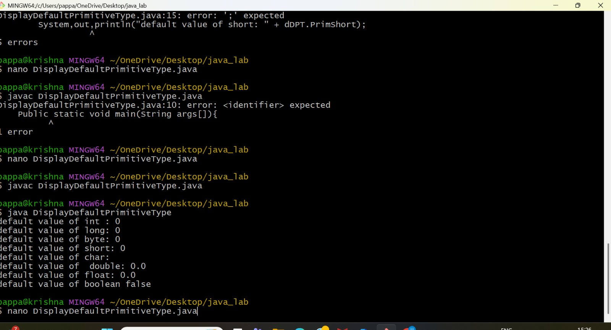

# Experiment-1
## 1a) TiTle: Display Default Primitive types
## Source Code
```java
class DisplayDefaultPrimitiveType{
    int PrimInt;
    long PrimLong;
    byte PrimByte;
    short PrimShort;
    char PrimChar;
    double PrimDouble;
    float PrimFloat;
    boolean PrimBoolean;
    public static void main(String args[]){
        DisplayDefaultPrimitiveType dDPT = new DisplayDefaultPrimitiveType();
        System.out.println("default value of int : " + dDPT.PrimInt);
        System.out.println("default value of long: " + dDPT.PrimLong);
        System.out.println("default value of byte: " + dDPT.PrimByte);
        System.out.println("default value of short: " + dDPT.PrimShort);
        System.out.println("default value of char: " + dDPT.PrimChar);
        System.out.println("default value of  double: " + dDPT.PrimDouble);
        System.out.println("default value of float: " + dDPT.PrimFloat);
        System.out.println("default value of boolean " + dDPT.PrimBoolean);
    }
}

```

## Output :


## Exp1b) Title: Calculate the roots of a Quadratic equation
## Source Code:
```java
import java.util.Scanner;
class quadraticeq {
    public static void main(String args[]) {
        Scanner sc = new Scanner(System.in);
        System.out.print("Enter value a: ");
        double a = sc.nextDouble();
        System.out.print("enter value b: ");
        double b = sc.nextDouble();
        System.out.print("enter value c: ");
        double c = sc.nextDouble();
        double D = b*b-4*a*c;
        if (D>0){
            double x1 = (-b+Math.sqrt(D))/(2*a);
            double x2 = (-b-Math.sqrt(D))/(2*a);
            System.out.println("the roots are:");
            System.out.println("x1= "+x1);
            System.out.println("x2+ "+x2);
        }
        else if(D==0) {
                double root1 = -b/2*a;
                System.out.println("The root is: " + root1);
        }
        else{
                double imgRoot1 =  Math.sqrt(-D)/2*a;
                double  realRoot = -b/2*a;
                System.out.println("The roots are:");
                System.out.println(realRoot + " + " + imgRoot1 + "i");
                System.out.println(realRoot + " - " + imgRoot1 + "i");

       }
```
## OUTPUT:
### CASE-1 (D>0)

### CASE-2 (D==0)

### CASE-3 (D<0)

